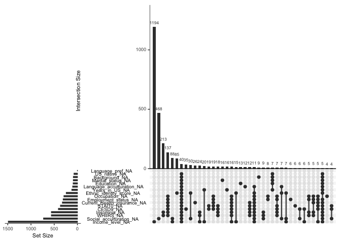

```r
library(tidyverse)
```

```
## ── Attaching core tidyverse packages ──────────────────────── tidyverse 2.0.0 ──
## ✔ dplyr     1.1.2     ✔ readr     2.1.4
## ✔ forcats   1.0.0     ✔ stringr   1.5.0
## ✔ ggplot2   3.4.2     ✔ tibble    3.2.1
## ✔ lubridate 1.9.2     ✔ tidyr     1.3.0
## ✔ purrr     1.0.1     
## ── Conflicts ────────────────────────────────────────── tidyverse_conflicts() ──
## ✖ dplyr::filter() masks stats::filter()
## ✖ dplyr::lag()    masks stats::lag()
## ℹ Use the conflicted package (<http://conflicted.r-lib.org/>) to force all conflicts to become errors
```

```r
library(survey)
```

```
## Loading required package: grid
## Loading required package: Matrix
## 
## Attaching package: 'Matrix'
## 
## The following objects are masked from 'package:tidyr':
## 
##     expand, pack, unpack
## 
## Loading required package: survival
## 
## Attaching package: 'survey'
## 
## The following object is masked from 'package:graphics':
## 
##     dotchart
```

```r
library(plyr)
```

```
## ------------------------------------------------------------------------------
## You have loaded plyr after dplyr - this is likely to cause problems.
## If you need functions from both plyr and dplyr, please load plyr first, then dplyr:
## library(plyr); library(dplyr)
## ------------------------------------------------------------------------------
## 
## Attaching package: 'plyr'
## 
## The following objects are masked from 'package:dplyr':
## 
##     arrange, count, desc, failwith, id, mutate, rename, summarise,
##     summarize
## 
## The following object is masked from 'package:purrr':
## 
##     compact
```

```r
library(dplyr)
library(factoextra)
```

```
## Welcome! Want to learn more? See two factoextra-related books at https://goo.gl/ve3WBa
```

```r
library(labelled)
library(tableone)
library(memisc)
```

```
## Loading required package: lattice
## Loading required package: MASS
## 
## Attaching package: 'MASS'
## 
## The following object is masked from 'package:dplyr':
## 
##     select
## 
## 
## Attaching package: 'memisc'
## 
## The following object is masked from 'package:plyr':
## 
##     rename
## 
## The following object is masked from 'package:Matrix':
## 
##     as.array
## 
## The following objects are masked from 'package:lubridate':
## 
##     as.interval, is.interval
## 
## The following objects are masked from 'package:dplyr':
## 
##     collect, recode, rename, syms
## 
## The following object is masked from 'package:purrr':
## 
##     %@%
## 
## The following object is masked from 'package:tibble':
## 
##     view
## 
## The following object is masked from 'package:ggplot2':
## 
##     syms
## 
## The following objects are masked from 'package:stats':
## 
##     contr.sum, contr.treatment, contrasts
## 
## The following object is masked from 'package:base':
## 
##     as.array
```

```r
library(sjlabelled)
```

```
## 
## Attaching package: 'sjlabelled'
## 
## The following objects are masked from 'package:labelled':
## 
##     copy_labels, remove_labels, to_character, to_factor, val_labels
## 
## The following object is masked from 'package:forcats':
## 
##     as_factor
## 
## The following object is masked from 'package:dplyr':
## 
##     as_label
## 
## The following object is masked from 'package:ggplot2':
## 
##     as_label
```

```r
library(mi)
```

```
## Loading required package: stats4
## mi (Version 1.1, packaged: 2022-06-05 05:31:15 UTC; ben)
## mi  Copyright (C) 2008, 2009, 2010, 2011, 2012, 2013, 2014, 2015 Trustees of Columbia University
## This program comes with ABSOLUTELY NO WARRANTY.
## This is free software, and you are welcome to redistribute it
## under the General Public License version 2 or later.
## Execute RShowDoc('COPYING') for details.
## 
## Attaching package: 'mi'
## 
## The following object is masked from 'package:tidyr':
## 
##     complete
```

```r
library(boot)
```

```
## 
## Attaching package: 'boot'
## 
## The following object is masked from 'package:lattice':
## 
##     melanoma
## 
## The following object is masked from 'package:survival':
## 
##     aml
```

```r
library(glmnet)
```

```
## Loaded glmnet 4.1-7
```

```r
library(mice)
```

```
## 
## Attaching package: 'mice'
## 
## The following objects are masked from 'package:mi':
## 
##     complete, pool
## 
## The following object is masked from 'package:stats':
## 
##     filter
## 
## The following objects are masked from 'package:base':
## 
##     cbind, rbind
```

```r
library(UpSetR)
```

```
## 
## Attaching package: 'UpSetR'
## 
## The following object is masked from 'package:lattice':
## 
##     histogram
```

```r
library(naniar)
```

# Read in the data


```r
folder_path <- "/Users/tamarsofer/Library/CloudStorage/OneDrive-BethIsraelLaheyHealth/Ongoing_papers/2022_gender_measure"
data_with_sleep <- read_csv(file.path(folder_path, "Data/sol_sofer_sorajja_joon_covariates_20220810.csv"))
```

```
## Warning: One or more parsing issues, call `problems()` on your data frame for details,
## e.g.:
##   dat <- vroom(...)
##   problems(dat)
```

```
## Rows: 16415 Columns: 44
## ── Column specification ────────────────────────────────────────────────────────
## Delimiter: ","
## chr  (8): ID, CENTER, GENDER, BKGRD1_C7, SLEA7, WBEA1, WBEA5, WBEA10
## dbl (36): STRAT, PSU_ID, WEIGHT_FINAL_NORM_OVERALL, AGE, US_BORN, BMI, STAI1...
## 
## ℹ Use `spec()` to retrieve the full column specification for this data.
## ℹ Specify the column types or set `show_col_types = FALSE` to quiet this message.
```

Remove CESD10, we will recompute it without the sleep-related question; factor variables.


```r
data_with_sleep <- data_with_sleep %>%
  dplyr::select(-CESD10)
data_with_sleep$GENDER <- as.factor(data_with_sleep$GENDER)
data_with_sleep$CENTER <- as.factor(data_with_sleep$CENTER)
data_with_sleep$BKGRD1_C7 <- as.factor(data_with_sleep$BKGRD1_C7)
data_with_sleep$EDUCATION_C3 <- as.factor(data_with_sleep$EDUCATION_C3)
```

# Creating Insomnia Indicator Variable (Dichotomizing WHIIRS)


```r
data_with_sleep <- data_with_sleep %>%
  mutate(Insomnia = case_when(WHIIRS >= 10 ~ "1",
                              WHIIRS < 10 ~ "0")) 
```

# creating a new CESD variable that exclude sleep question
Sum WBEA1-WBEA10, without WBEA7 ("Sleep was restless (WBEA7)"). WBEA5 and WBEA8 are positive questions -- therefore need to be recoded. 


```r
wbea_cols <- paste0("WBEA", c(1:6, 8:10))
dat_cesd <- data_with_sleep[,c("ID", wbea_cols)]

for (col in wbea_cols){
  inds_q <- which(dat_cesd[,col] == "Q")
  if (length(inds_q) > 0){
    dat_cesd[inds_q,col] <- NA  
  }
}

# omg we have to do better!
dat_cesd <- dat_cesd %>% mutate(WBEA1 = as.numeric(WBEA1),
                    WBEA2 = as.numeric(WBEA2),
                    WBEA3 = as.numeric(WBEA3),
                    WBEA4 = as.numeric(WBEA4),
                    WBEA5 = as.numeric(WBEA5),
                    WBEA6 = as.numeric(WBEA6),
                    WBEA8 = as.numeric(WBEA8),
                    WBEA9 = as.numeric(WBEA9),
                    WBEA10 = as.numeric(WBEA10))

dat_cesd$WBEA5r <- 3-dat_cesd$WBEA5
dat_cesd$WBEA8r <- 3-dat_cesd$WBEA8

dat_cesd$num_items <- apply(dat_cesd[,wbea_cols], 1,
                                          function(x){sum(!is.na(x))})

# we only compute CESD to individuals with up to two missing values, i.e. with at least 7 values.

print("The distribution of respnoss to CESD items excluding sleep question")
```

```
## [1] "The distribution of respnoss to CESD items excluding sleep question"
```

```r
summary(as.factor(dat_cesd$num_items))
```

```
##     0     1     4     5     6     7     8     9 
##   351     1     2     1     1     9    44 16006
```

```r
# compute CESD for everyone, then set to NA for people with missing values
# scale to the same value range as if we had 10 items available
dat_cesd$CESD <- (10/9)*rowSums(dat_cesd[,wbea_cols])*(9/dat_cesd$num_items)

# set to NA
dat_cesd$CESD[which(dat_cesd$num_items<7)] <- NA

# merge CESD variable to the main dataset

data_with_sleep <- merge(data_with_sleep, dat_cesd[,c("ID", "CESD")], by = "ID")

data_with_sleep <- data_with_sleep %>%
  dplyr::select(-WBEA1,- WBEA2, -WBEA3,
                -WBEA4,- WBEA5, -WBEA6,
                -WBEA7,- WBEA8, -WBEA9, -WBEA10)
```

# Adding labels etc

```r
dat <- data_with_sleep %>%
  mutate(
    Gender=factor(GENDER,levels = c("F","M"),labels=c("Female","Male")),
    Education=factor(EDUCATION_C3,levels = c("1","2","3"),labels=c("<12","12",">12")),
    Center=factor(CENTER,levels = c("B","C","M","S"),labels=c("Bronx","Chicago", "Miami", "San Diego")),
    Income_level=factor(INCOME_C5,levels = c("1","2","3","4", "5"),labels = c("Less than $10,000","$10,001-$20,000","$20,001-$40,000","$40,001-$75,000","More than $75,000")),
    Current_Health_insurance=factor(N_HC,levels = c("0","1"),labels = c("No","Yes")),
    Background=factor(BKGRD1_C7,levels = c("0","1","2","3","4", "5","6"),labels = c("Domician","Central American","Cuban","Mexican","Puerto Rican","South American","More than one/Other heritage")),
    Language_pref = factor(LANG_PREF, levels = c("1", "2"), labels = c("Spanish", "English")),
    Marital_status=factor(MARITAL_STATUS,levels=c("1","2","3"),labels = c(
      "Single","Married or living with a partner","Separated,divorced,or widow(er)")),
    Employment_status=factor(EMPLOYED, levels=c("1","2","3","4"),labels = c("Retired/not currently employed","Not retired and not currently employed","Employed part-time(<=35 hours/week)","Employed full-time(>35 hours/week)")),
    US_native=factor(US_NATIVE, levels=c("0","1"),labels = c("No","Yes")),
    Occupation = factor(OCCUPATION_LONG, levels = c("1", "2", "3", "4", "5"), labels = c("Non-skilled worker", "Service Worker", "Skilled Worker", "Professional/technical, administrative/executive, or office staff", "Other occupation")),
    Years_in_US = factor(YRSUS_C3, levels = c("1", "2", "3"), labels = c("Less than 10 Years", "10 Years or More", "US born")),
    Insomnia = factor(Insomnia, levels = c("0", "1"), labels = c("No", "Yes")), 
    Age = AGE,
    Social_acculturation = SASH_SOC, 
    Language_acculturation = SASH_LANG,
    Ethnic_identity_score = ETHIS
  )


dat$Employment_status <- relabel(
  dat$Employment_status,
  "Retired/not currently employed" ="Retired/not currently employed",
  "Not retired and not currently employed"="Retired/not currently employed"
)
```

```
## Warning in relabel.factor(dat$Employment_status, `Retired/not currently
## employed` = "Retired/not currently employed", : Duplicate labels
```

# Creating a missing values plot

```r
# variables of interest (not including center, age, gender, 
#   which have no missing values are are considered "baseline" variables)
vars <-  c("Marital_status",
            "Income_level",
            "Employment_status",
            "Occupation",
            "Language_pref",
            "US_native",
            "Language_acculturation",
            "Social_acculturation",
            "Ethnic_identity_score", 
            "Current_Health_insurance", 
            "Years_in_US",
            "Background", 
            "Education",
            "STAI10",
            "CESD",
            "Insomnia", 
            "WHIIRS")

pdf(file = file.path(folder_path, "Results", "Missing_upset_plot.pdf"), height = 10, width = 10)
gg_miss_upset(dat[,vars], nsets = length(vars))
dev.off()
```

```
## quartz_off_screen 
##                 2
```

```r
gg_miss_upset(dat[,vars], nsets = length(vars))
```

<!-- -->
# Save data set (with missing data) 


```r
req_vars <- c("ID", "STRAT", "PSU_ID", "WEIGHT_FINAL_NORM_OVERALL", 
              "Center", "Age", "Gender")

dat_to_save <- dat[,c(req_vars, vars)]
saveRDS(dat_to_save, file = file.path(folder_path, "Data/Data_with_miss.Rds"))
```


```r
sessionInfo()
```

```
## R version 4.2.3 (2023-03-15)
## Platform: aarch64-apple-darwin20 (64-bit)
## Running under: macOS Ventura 13.6
## 
## Matrix products: default
## BLAS:   /Library/Frameworks/R.framework/Versions/4.2-arm64/Resources/lib/libRblas.0.dylib
## LAPACK: /Library/Frameworks/R.framework/Versions/4.2-arm64/Resources/lib/libRlapack.dylib
## 
## locale:
## [1] en_US.UTF-8/en_US.UTF-8/en_US.UTF-8/C/en_US.UTF-8/en_US.UTF-8
## 
## attached base packages:
## [1] stats4    grid      stats     graphics  grDevices utils     datasets 
## [8] methods   base     
## 
## other attached packages:
##  [1] naniar_1.0.0     UpSetR_1.4.0     mice_3.16.0      glmnet_4.1-7    
##  [5] boot_1.3-28.1    mi_1.1           sjlabelled_1.2.0 memisc_0.99.31.6
##  [9] MASS_7.3-60      lattice_0.21-8   tableone_0.13.2  labelled_2.12.0 
## [13] factoextra_1.0.7 plyr_1.8.8       survey_4.2-1     survival_3.5-5  
## [17] Matrix_1.5-4.1   lubridate_1.9.2  forcats_1.0.0    stringr_1.5.0   
## [21] dplyr_1.1.2      purrr_1.0.1      readr_2.1.4      tidyr_1.3.0     
## [25] tibble_3.2.1     ggplot2_3.4.2    tidyverse_2.0.0 
## 
## loaded via a namespace (and not attached):
##  [1] nlme_3.1-162      bit64_4.0.5       insight_0.19.3    tools_4.2.3      
##  [5] backports_1.4.1   bslib_0.5.0       utf8_1.2.3        R6_2.5.1         
##  [9] rpart_4.1.19      DBI_1.1.3         colorspace_2.1-0  jomo_2.7-6       
## [13] nnet_7.3-19       withr_2.5.0       tidyselect_1.2.0  gridExtra_2.3    
## [17] bit_4.0.5         compiler_4.2.3    cli_3.6.1         labeling_0.4.2   
## [21] sass_0.4.7        scales_1.2.1      digest_0.6.33     minqa_1.2.5      
## [25] rmarkdown_2.23    pkgconfig_2.0.3   htmltools_0.5.5   lme4_1.1-34      
## [29] highr_0.10        fastmap_1.1.1     rlang_1.1.1       rstudioapi_0.15.0
## [33] farver_2.1.1      shape_1.4.6       jquerylib_0.1.4   generics_0.1.3   
## [37] jsonlite_1.8.7    vroom_1.6.3       car_3.1-2         magrittr_2.0.3   
## [41] Rcpp_1.0.11       munsell_0.5.0     fansi_1.0.4       abind_1.4-5      
## [45] lifecycle_1.0.3   visdat_0.6.0      stringi_1.7.12    yaml_2.3.7       
## [49] carData_3.0-5     parallel_4.2.3    ggrepel_0.9.3     crayon_1.5.2     
## [53] mitml_0.4-5       haven_2.5.3       splines_4.2.3     hms_1.1.3        
## [57] knitr_1.43        pillar_1.9.0      codetools_0.2-19  pan_1.8          
## [61] glue_1.6.2        evaluate_0.21     mitools_2.4       data.table_1.14.8
## [65] vctrs_0.6.3       nloptr_2.0.3      tzdb_0.4.0        foreach_1.5.2    
## [69] gtable_0.3.3      cachem_1.0.8      xfun_0.39         broom_1.0.5      
## [73] coda_0.19-4       arm_1.13-1        iterators_1.0.14  timechange_0.2.0
```
