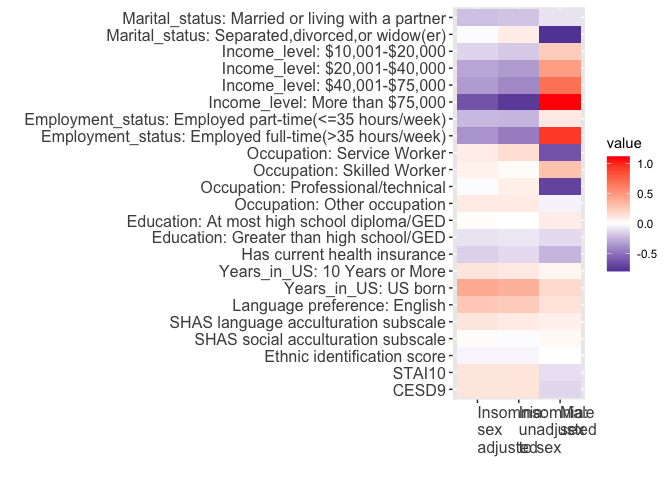

```r
library(tidyverse)
```

```
## ── Attaching core tidyverse packages ──────────────────────── tidyverse 2.0.0 ──
## ✔ dplyr     1.1.2     ✔ readr     2.1.4
## ✔ forcats   1.0.0     ✔ stringr   1.5.0
## ✔ ggplot2   3.4.2     ✔ tibble    3.2.1
## ✔ lubridate 1.9.2     ✔ tidyr     1.3.0
## ✔ purrr     1.0.1     
## ── Conflicts ────────────────────────────────────────── tidyverse_conflicts() ──
## ✖ dplyr::filter() masks stats::filter()
## ✖ dplyr::lag()    masks stats::lag()
## ℹ Use the conflicted package (<http://conflicted.r-lib.org/>) to force all conflicts to become errors
```

```r
library(survey)
```

```
## Loading required package: grid
## Loading required package: Matrix
## 
## Attaching package: 'Matrix'
## 
## The following objects are masked from 'package:tidyr':
## 
##     expand, pack, unpack
## 
## Loading required package: survival
## 
## Attaching package: 'survey'
## 
## The following object is masked from 'package:graphics':
## 
##     dotchart
```

```r
library(plyr)
```

```
## ------------------------------------------------------------------------------
## You have loaded plyr after dplyr - this is likely to cause problems.
## If you need functions from both plyr and dplyr, please load plyr first, then dplyr:
## library(plyr); library(dplyr)
## ------------------------------------------------------------------------------
## 
## Attaching package: 'plyr'
## 
## The following objects are masked from 'package:dplyr':
## 
##     arrange, count, desc, failwith, id, mutate, rename, summarise,
##     summarize
## 
## The following object is masked from 'package:purrr':
## 
##     compact
```

```r
library(dplyr)
library(factoextra)
```

```
## Welcome! Want to learn more? See two factoextra-related books at https://goo.gl/ve3WBa
```

```r
library(labelled)
library(tableone)
library(memisc)
```

```
## Loading required package: lattice
## Loading required package: MASS
## 
## Attaching package: 'MASS'
## 
## The following object is masked from 'package:dplyr':
## 
##     select
## 
## 
## Attaching package: 'memisc'
## 
## The following object is masked from 'package:plyr':
## 
##     rename
## 
## The following object is masked from 'package:Matrix':
## 
##     as.array
## 
## The following objects are masked from 'package:lubridate':
## 
##     as.interval, is.interval
## 
## The following objects are masked from 'package:dplyr':
## 
##     collect, recode, rename, syms
## 
## The following object is masked from 'package:purrr':
## 
##     %@%
## 
## The following object is masked from 'package:tibble':
## 
##     view
## 
## The following object is masked from 'package:ggplot2':
## 
##     syms
## 
## The following objects are masked from 'package:stats':
## 
##     contr.sum, contr.treatment, contrasts
## 
## The following object is masked from 'package:base':
## 
##     as.array
```

```r
library(sjlabelled)
```

```
## 
## Attaching package: 'sjlabelled'
## 
## The following objects are masked from 'package:labelled':
## 
##     copy_labels, remove_labels, to_character, to_factor, val_labels
## 
## The following object is masked from 'package:forcats':
## 
##     as_factor
## 
## The following object is masked from 'package:dplyr':
## 
##     as_label
## 
## The following object is masked from 'package:ggplot2':
## 
##     as_label
```

```r
library(mi)
```

```
## Loading required package: stats4
## mi (Version 1.1, packaged: 2022-06-05 05:31:15 UTC; ben)
## mi  Copyright (C) 2008, 2009, 2010, 2011, 2012, 2013, 2014, 2015 Trustees of Columbia University
## This program comes with ABSOLUTELY NO WARRANTY.
## This is free software, and you are welcome to redistribute it
## under the General Public License version 2 or later.
## Execute RShowDoc('COPYING') for details.
## 
## Attaching package: 'mi'
## 
## The following object is masked from 'package:tidyr':
## 
##     complete
```

```r
library(boot)
```

```
## 
## Attaching package: 'boot'
## 
## The following object is masked from 'package:lattice':
## 
##     melanoma
## 
## The following object is masked from 'package:survival':
## 
##     aml
```

```r
library(glmnet)
```

```
## Loaded glmnet 4.1-7
```

```r
library(UpSetR)
```

```
## 
## Attaching package: 'UpSetR'
## 
## The following object is masked from 'package:lattice':
## 
##     histogram
```

```r
library(naniar)
library(RColorBrewer)
library(svyVGAM)
```

```
## Loading required package: VGAM
## Loading required package: splines
## 
## Attaching package: 'VGAM'
## 
## The following objects are masked from 'package:boot':
## 
##     logit, simplex
## 
## The following object is masked from 'package:mi':
## 
##     multinomial
## 
## The following object is masked from 'package:memisc':
## 
##     Max
## 
## The following object is masked from 'package:survey':
## 
##     calibrate
```

```r
library(jtools)
```

```
## 
## Attaching package: 'jtools'
## 
## The following object is masked from 'package:memisc':
## 
##     %nin%
```

```r
library(reshape2)
```

```
## 
## Attaching package: 'reshape2'
## 
## The following object is masked from 'package:tidyr':
## 
##     smiths
```

# Read in the data


```r
folder_path <- "/Users/tamarsofer/Library/CloudStorage/OneDrive-BethIsraelLaheyHealth/Ongoing_papers/2022_gender_measure"
data_with_sleep <- read_csv(file.path(folder_path, "Data/sol_sofer_sorajja_joon_covariates_20220810.csv"))
```

```
## Warning: One or more parsing issues, call `problems()` on your data frame for details,
## e.g.:
##   dat <- vroom(...)
##   problems(dat)
```

```
## Rows: 16415 Columns: 44
## ── Column specification ────────────────────────────────────────────────────────
## Delimiter: ","
## chr  (8): ID, CENTER, GENDER, BKGRD1_C7, SLEA7, WBEA1, WBEA5, WBEA10
## dbl (36): STRAT, PSU_ID, WEIGHT_FINAL_NORM_OVERALL, AGE, US_BORN, BMI, STAI1...
## 
## ℹ Use `spec()` to retrieve the full column specification for this data.
## ℹ Specify the column types or set `show_col_types = FALSE` to quiet this message.
```

```r
# load the prepared dataset
dat <- readRDS(file.path(folder_path, "Data/Data_with_miss.Rds"))
```

# Prepare for table 2


```r
# survey object
survey_base <- svydesign(id = ~PSU_ID,
                          strata = ~STRAT,
                          weights = ~WEIGHT_FINAL_NORM_OVERALL,
                          nest = TRUE,
                          data = dat)
sleepDesign <- subset(survey_base, complete.cases(dat))

# baseline covariates to adjust for
adj_vars <- c("Age", "Center", "Background")

# multi-level variables to be analyzed in multinomial regression
multi_vars <- c("Marital_status", 
                "Occupation",
                "Income_level",
                "Employment_status", 
                "Education", 
                "Years_in_US")
# not multi-level ones:
single_vars  <- c("Language_pref",
                 "Current_Health_insurance",
                 "Language_acculturation",
                  "Social_acculturation",
                  "Ethnic_identity_score", 
                  "STAI10",
                  "CESD")

cont_vars  <- c( "Language_acculturation",
                  "Social_acculturation",
                 "Ethnic_identity_score", 
                  "STAI10",
                  "CESD")

binary_vars  <- c("Language_pref",
                 "Current_Health_insurance")
```

# functions to extract summarized results from analysis, when gender is exposure

```r
extract_mult_out <- function(mod, exposure, out_name, level_names, round_digit = 2){
  est <- summary(mod)$coeftable
  confint <- confint(mod)
  
  inds <- grep(exposure, rownames(est))
  df_out <- data.frame(outcome = paste0(out_name,": ", level_names), 
                       est = round(exp(est[inds, "Coef"]),round_digit), 
                       CI = paste0("(", round(exp(confint[inds, 1]), round_digit), ",",
                                   round(exp(confint[inds, 2]), round_digit), ")"),
                       pval = formatC(est[inds, "p"], digits = round_digit, format = "E"))
  return(df_out)
}


extract_one_out <- function(mod, exposure, out_name, exponentiate = TRUE, round_digit = 2){
   est <- summary(mod)$coef
   confint <- confint(mod)
  
  ind <- grep(exposure, rownames(est))
  
  if (exponentiate){
      df_out <- data.frame(outcome = out_name, 
                       est = round(exp(est[ind, "Estimate"]),round_digit), 
                       CI = paste0("(", round(exp(confint[ind, 1]), round_digit), ",",
                                   round(exp(confint[ind, 2]), round_digit), ")"),
                       pval = formatC(est[ind, "Pr(>|t|)"], digits = round_digit, format = "E"))
  } else{
     df_out <- data.frame(outcome = out_name, 
                       est = round(est[ind, "Estimate"],round_digit), 
                       CI = paste0("(", round(confint[ind, 1], round_digit), ",",
                                   round(confint[ind, 2], round_digit), ")"),
                       pval = formatC(est[ind, "Pr(>|t|)"], digits = round_digit, format = "E"))
  }

  return(df_out)
}
```

# Prepare a table of results: gender is exposure


```r
all_out <- vector(mode = "list", length = length(multi_vars) + length(single_vars))
ind <- 1

for (var in multi_vars){
  vglm_mod <- svy_vglm(formula = as.formula(paste0(var, "~Gender+Age+Center+Background")), design = sleepDesign, family = multinomial(refLevel = 1), drop.unused.levels = TRUE)
  
  all_out[[ind]] <- extract_mult_out(vglm_mod, 
                                     exposure = "Gender", 
                                     out_name  = var, 
                                     level_names  = levels(dat[[var]])[-1])
  ind <- ind + 1
}
```

```
## Warning in vglm.fitter(x = x, y = y, w = w, offset = offset, Xm2 = Xm2, : some
## quantities such as z, residuals, SEs may be inaccurate due to convergence at a
## half-step
```

```r
for (var in cont_vars){
  mod <- svyglm(formula = as.formula(paste0(var, "~Gender+Age+Center+Background")), design = sleepDesign, family = quasipoisson())
  
  all_out[[ind]] <- extract_one_out(mod, 
                                     exposure = "Gender", 
                                     out_name  = var, 
                                    exponentiate = FALSE)
  ind <- ind + 1
}

for (var in binary_vars){
  mod <- svyglm(formula = as.formula(paste0(var, "~Gender+Age+Center+Background")), design = sleepDesign, family = quasibinomial())
  
  all_out[[ind]] <- extract_one_out(mod, 
                                     exposure = "Gender", 
                                     out_name  = var, 
                                    exponentiate= TRUE)
  ind <- ind + 1
}


gender_tab <- do.call(rbind, all_out)
rownames(gender_tab) <- paste0("r", 1:nrow(gender_tab))
print(gender_tab)
```

```
##                                                                           outcome
## r1                               Marital_status: Married or living with a partner
## r2                                Marital_status: Separated,divorced,or widow(er)
## r3                                                     Occupation: Service Worker
## r4                                                     Occupation: Skilled Worker
## r5  Occupation: Professional/technical, administrative/executive, or office staff
## r6                                                   Occupation: Other occupation
## r7                                                  Income_level: $10,001-$20,000
## r8                                                  Income_level: $20,001-$40,000
## r9                                                  Income_level: $40,001-$75,000
## r10                                               Income_level: More than $75,000
## r11                        Employment_status: Employed part-time(<=35 hours/week)
## r12                         Employment_status: Employed full-time(>35 hours/week)
## r13                                                                 Education: 12
## r14                                                                Education: >12
## r15                                                 Years_in_US: 10 Years or More
## r16                                                          Years_in_US: US born
## r17                                                        Language_acculturation
## r18                                                          Social_acculturation
## r19                                                         Ethnic_identity_score
## r20                                                                        STAI10
## r21                                                                          CESD
## r22                                                                 Language_pref
## r23                                                      Current_Health_insurance
##       est            CI     pval
## r1   0.91    (0.8,1.02) 1.04E-01
## r2   0.45   (0.38,0.54) 2.34E-18
## r3   0.53   (0.45,0.63) 3.00E-13
## r4   1.33   (1.15,1.53) 9.29E-05
## r5   0.49     (0.4,0.6) 1.15E-12
## r6   0.96   (0.82,1.12) 5.94E-01
## r7   1.27    (1.08,1.5) 3.29E-03
## r8   1.59   (1.36,1.86) 4.81E-09
## r9   1.99   (1.67,2.38) 1.68E-14
## r10  3.06   (2.36,3.96) 2.43E-17
## r11  1.11   (0.96,1.28) 1.56E-01
## r12  2.54   (2.24,2.87) 7.44E-49
## r13  1.09   (0.95,1.24) 2.18E-01
## r14  0.89      (0.78,1) 5.30E-02
## r15  1.05   (0.93,1.19) 4.58E-01
## r16  1.19      (1,1.42) 5.63E-02
## r17  0.07   (0.05,0.09) 3.99E-09
## r18  0.03   (0.02,0.04) 1.57E-05
## r19  0.00  (-0.01,0.01) 7.93E-01
## r20 -0.10 (-0.11,-0.08) 1.80E-30
## r21 -0.13 (-0.15,-0.11) 3.79E-28
## r22  1.15   (0.99,1.33) 7.00E-02
## r23  0.78   (0.71,0.86) 1.38E-06
```

```r
write.csv(gender_tab, file = file.path(folder_path, "Results/All_vars_assoc_gender.csv"))
```

# functions to extract summarized results when insomnia is outcome


```r
extract_mult_exp <- function(mod, exposure, level_names, round_digit = 2){
  est <- summary(mod)$coef
  confint <- confint(mod)
  
  inds <- grep(exposure, rownames(est))
  df_out <- data.frame(exposure = paste0(exposure,": ", level_names), 
                       est = round(exp(est[inds, "Estimate"]),round_digit), 
                        CI = paste0("(", round(exp(confint[inds, 1]), round_digit), ",",
                                   round(exp(confint[inds, 2]), round_digit), ")"),
                       pval = formatC(est[inds, "Pr(>|t|)"], digits = round_digit, format = "E"))
  return(df_out)
}


extract_one_exp <- function(mod, exposure, round_digit = 2){
   est <- summary(mod)$coef
   confint <- confint(mod)
  
  ind <- grep(exposure, rownames(est))
  
  df_out <- data.frame(exposure = exposure, 
                       est = round(exp(est[ind, "Estimate"]),round_digit),
                        CI = paste0("(", round(exp(confint[ind, 1]), round_digit), ",",
                                   round(exp(confint[ind, 2]), round_digit), ")"),
                       pval = formatC(est[ind, "Pr(>|t|)"], digits = round_digit, format = "E"))
 

  return(df_out)
}
```

# Prepare a table of results: insomnia is outcome, gender unadjusted


```r
all_out <- vector(mode = "list", length = length(multi_vars) + length(single_vars))
ind <- 1

for (var in multi_vars){
   mod <- svyglm(formula = as.formula(paste0("Insomnia~Age+Center+Background+", var)), 
                 design = sleepDesign, family = quasibinomial())
   

  all_out[[ind]] <- extract_mult_exp(mod, 
                                     exposure = var, 
                                     level_names  = levels(dat[[var]])[-1])
  ind <- ind + 1
}


for (var in c(cont_vars, binary_vars)){
  mod <- svyglm(formula = as.formula(paste0("Insomnia~Age+Center+Background+", var)), 
                design = sleepDesign, family = quasibinomial())
  
  all_out[[ind]] <- extract_one_exp(mod, 
                                     exposure = var)
  ind <- ind + 1
}


insomnia_no_gender_tab <- do.call(rbind, all_out)
rownames(insomnia_no_gender_tab) <- paste0("r", 1:nrow(gender_tab))
print(insomnia_no_gender_tab)
```

```
##                                                                          exposure
## r1                               Marital_status: Married or living with a partner
## r2                                Marital_status: Separated,divorced,or widow(er)
## r3                                                     Occupation: Service Worker
## r4                                                     Occupation: Skilled Worker
## r5  Occupation: Professional/technical, administrative/executive, or office staff
## r6                                                   Occupation: Other occupation
## r7                                                  Income_level: $10,001-$20,000
## r8                                                  Income_level: $20,001-$40,000
## r9                                                  Income_level: $40,001-$75,000
## r10                                               Income_level: More than $75,000
## r11                        Employment_status: Employed part-time(<=35 hours/week)
## r12                         Employment_status: Employed full-time(>35 hours/week)
## r13                                                                 Education: 12
## r14                                                                Education: >12
## r15                                                 Years_in_US: 10 Years or More
## r16                                                          Years_in_US: US born
## r17                                                        Language_acculturation
## r18                                                          Social_acculturation
## r19                                                         Ethnic_identity_score
## r20                                                                        STAI10
## r21                                                                          CESD
## r22                                                                 Language_pref
## r23                                                      Current_Health_insurance
##      est          CI     pval
## r1  0.82 (0.72,0.94) 3.81E-03
## r2  1.09 (0.92,1.29) 3.26E-01
## r3  1.17 (0.96,1.43) 1.10E-01
## r4  1.02  (0.87,1.2) 7.74E-01
## r5  1.08  (0.9,1.31) 4.12E-01
## r6  1.10 (0.91,1.32) 3.12E-01
## r7  0.84 (0.72,0.99) 3.77E-02
## r8  0.71 (0.59,0.84) 1.19E-04
## r9  0.66 (0.52,0.82) 1.97E-04
## r10 0.47 (0.32,0.69) 1.33E-04
## r11 0.78 (0.67,0.92) 3.49E-03
## r12 0.63 (0.56,0.72) 1.41E-12
## r13 1.00 (0.85,1.18) 9.87E-01
## r14 0.92  (0.8,1.06) 2.51E-01
## r15 1.11 (0.97,1.28) 1.25E-01
## r16 1.45 (1.19,1.77) 2.09E-04
## r17 1.10 (1.03,1.18) 4.27E-03
## r18 0.99 (0.88,1.11) 8.85E-01
## r19 0.97 (0.88,1.08) 5.81E-01
## r20 1.13 (1.12,1.14) 5.06E-81
## r21 1.13 (1.12,1.15) 3.57E-67
## r22 1.28 (1.08,1.51) 3.80E-03
## r23 0.89 (0.78,1.02) 1.02E-01
```

```r
write.csv(insomnia_no_gender_tab, file = file.path(folder_path, "Results/All_vars_assoc_insomnia_no_gender.csv"))
```


# Prepare a table of results: insomnia is outcome, gender adjusted


```r
all_out <- vector(mode = "list", length = length(multi_vars) + length(single_vars))
ind <- 1

for (var in multi_vars){
   mod <- svyglm(formula = as.formula(paste0("Insomnia~Gender + Age+Center+Background+", var)), 
                 design = sleepDesign, family = quasibinomial())
   

  all_out[[ind]] <- extract_mult_exp(mod, 
                                     exposure = var, 
                                     level_names  = levels(dat[[var]])[-1])
  ind <- ind + 1
}


for (var in c(cont_vars, binary_vars)){
  mod <- svyglm(formula = as.formula(paste0("Insomnia~Gender+Age+Center+Background+", var)), 
                design = sleepDesign, family = quasibinomial())
  
  all_out[[ind]] <- extract_one_exp(mod, 
                                     exposure = var)
  ind <- ind + 1
}


insomnia_gender_adj_tab <- do.call(rbind, all_out)
rownames(insomnia_gender_adj_tab) <- paste0("r", 1:nrow(gender_tab))
print(insomnia_gender_adj_tab)
```

```
##                                                                          exposure
## r1                               Marital_status: Married or living with a partner
## r2                                Marital_status: Separated,divorced,or widow(er)
## r3                                                     Occupation: Service Worker
## r4                                                     Occupation: Skilled Worker
## r5  Occupation: Professional/technical, administrative/executive, or office staff
## r6                                                   Occupation: Other occupation
## r7                                                  Income_level: $10,001-$20,000
## r8                                                  Income_level: $20,001-$40,000
## r9                                                  Income_level: $40,001-$75,000
## r10                                               Income_level: More than $75,000
## r11                        Employment_status: Employed part-time(<=35 hours/week)
## r12                         Employment_status: Employed full-time(>35 hours/week)
## r13                                                                 Education: 12
## r14                                                                Education: >12
## r15                                                 Years_in_US: 10 Years or More
## r16                                                          Years_in_US: US born
## r17                                                        Language_acculturation
## r18                                                          Social_acculturation
## r19                                                         Ethnic_identity_score
## r20                                                                        STAI10
## r21                                                                          CESD
## r22                                                                 Language_pref
## r23                                                      Current_Health_insurance
##      est          CI     pval
## r1  0.81 (0.71,0.93) 2.78E-03
## r2  0.99 (0.84,1.17) 9.35E-01
## r3  1.09 (0.89,1.33) 4.17E-01
## r4  1.06  (0.9,1.24) 4.99E-01
## r5  0.99  (0.82,1.2) 9.47E-01
## r6  1.10 (0.91,1.31) 3.24E-01
## r7  0.87 (0.74,1.02) 8.70E-02
## r8  0.74 (0.62,0.89) 1.32E-03
## r9  0.71 (0.56,0.89) 3.08E-03
## r10 0.53 (0.36,0.78) 1.43E-03
## r11 0.79 (0.67,0.93) 5.35E-03
## r12 0.69 (0.61,0.79) 1.81E-08
## r13 1.01 (0.85,1.19) 9.10E-01
## r14 0.91 (0.78,1.05) 1.92E-01
## r15 1.13  (0.98,1.3) 9.38E-02
## r16 1.50 (1.23,1.82) 6.66E-05
## r17 1.13 (1.06,1.21) 3.62E-04
## r18 1.02 (0.91,1.14) 7.64E-01
## r19 0.97 (0.88,1.08) 6.10E-01
## r20 1.13 (1.12,1.14) 3.02E-75
## r21 1.13 (1.12,1.14) 1.27E-62
## r22 1.30  (1.1,1.54) 1.87E-03
## r23 0.86 (0.75,0.99) 3.32E-02
```

```r
write.csv(insomnia_gender_adj_tab, file = file.path(folder_path, "Results/All_vars_assoc_insomnia_gender_adj.csv"))
```


# Heatmap visualizing associations

For the heatmap, we will consolidate results from all models. We will use the log(OR) scale.


```r
# our 3 DFs with results are
# gender_tab
# insomnia_no_gender_tab
# insomnia_gender_adj_tab

heatmap_dat <- data.frame(Gender = gender_tab$est, 
                          Insomnia_gender_unadjusted = insomnia_no_gender_tab$est,
                          Insomnia_gender_adjusted = insomnia_gender_adj_tab$est)
rownames(heatmap_dat) <- gender_tab$outcome
# check:
all(gender_tab$outcome == insomnia_gender_adj_tab$exposure) # TRUE
```

```
## [1] TRUE
```

```r
heatmap_dat$Insomnia_gender_unadjusted <- log(heatmap_dat$Insomnia_gender_unadjusted)
heatmap_dat$Insomnia_gender_adjusted <- log(heatmap_dat$Insomnia_gender_adjusted)
inds_transform_gender <- which(!is.element(rownames(heatmap_dat), cont_vars))
heatmap_dat$Gender[inds_transform_gender] <- log(heatmap_dat$Gender[inds_transform_gender] )

# change some of variables names in the heatmap
rownames(heatmap_dat)[which(rownames(heatmap_dat) == "Language_acculturation")] <- "Short language acculturation scale"
rownames(heatmap_dat)[which(rownames(heatmap_dat) == "Social_acculturation")] <- "Short social acculturation scale"
rownames(heatmap_dat)[which(rownames(heatmap_dat) == "Ethnic_identity_score")] <- "Ethnic identification score"
rownames(heatmap_dat)[which(rownames(heatmap_dat) == "CESD")] <- "CESD9"

rownames(heatmap_dat)[which(rownames(heatmap_dat) == "Current_Health_insurance")] <- "Has current health insurance"

rownames(heatmap_dat)[which(rownames(heatmap_dat) == "Language_pref")] <- "Language preference: English"

rownames(heatmap_dat)[which(rownames(heatmap_dat) == "Occupation: Professional/technical, administrative/executive, or office staff")] <- "Occupation: Professional/technical"

rownames(heatmap_dat)[which(rownames(heatmap_dat) == "Employment_status: Employed part-time(<=35 hours/week)")] <- "Employment: part-time(<=35 hours/week)"

rownames(heatmap_dat)[which(rownames(heatmap_dat) == "Employment_status: Employed full-time(>35 hours/week)")] <- "Employment: full-time(>35 hours/week)"

rownames(heatmap_dat)[which(rownames(heatmap_dat) == "Marital_status: Married or living with a partner")] <- "Married or living with a partner"
rownames(heatmap_dat)[which(rownames(heatmap_dat) == "Marital_status: Separated,divorced,or widow(er)")] <- "Separated,divorced,or widow(er)"


heatmap_dat$y <- rownames(heatmap_dat)

## need to set the levels according to the ordered desired in the figure!
## doing it manually...
heatmap_dat$y <- factor(heatmap_dat$y, levels = heatmap_dat$y[rev(c(1:2,  #marital status
                                                                7:10, # income
                                                                11:12, # employment
                                                                3:6, # occupation
                                                                13:14, # education
                                                                23, # health insurance 
                                                                15:16, # years in US
                                                                22, # language preference
                                                                17:19, # acculturation scales
                                                                20:21))]) # psychological

heatmap_long <- pivot_longer(heatmap_dat, 
                             cols = c("Gender", "Insomnia_gender_unadjusted", "Insomnia_gender_adjusted"),
                             names_to = "x",
                             values_to = "value")

heatmap_long$x[which(heatmap_long$x == "Insomnia_gender_adjusted")] <- "Insomnia: sex adjusted" # "Insomnia:\n sex\n adjusted"
heatmap_long$x[which(heatmap_long$x == "Insomnia_gender_unadjusted")] <- "Insomnia: unadjusted to sex" # "Insomnia:\n unadjusted\n to sex"
heatmap_long$x[which(heatmap_long$x == "Gender")] <- "Male sex" #"Male\n sex"

ggplot(heatmap_long, aes(x = x, y = y)) + 
    geom_tile(aes(fill = value)) + 
      ggtitle("Adjusted associations with sex and insomnia") +   
      scale_fill_gradient2(low = "navy", mid = "white", high = "red") + 
      ylab("") + xlab("") + 
      theme(axis.text.x = element_text( hjust= 0, size = 12), 
            axis.text.y = element_text(size = 12)) + 
          scale_x_discrete(labels = function(x) str_wrap(x, width = 7))
```

<!-- -->

```r
ggsave(file = file.path(folder_path, "Results/Heatmap_sex_insomnia_assoc.pdf"), width = 7, height = 6)
```


```r
sessionInfo()
```

```
## R version 4.2.3 (2023-03-15)
## Platform: aarch64-apple-darwin20 (64-bit)
## Running under: macOS Ventura 13.3.1
## 
## Matrix products: default
## BLAS:   /Library/Frameworks/R.framework/Versions/4.2-arm64/Resources/lib/libRblas.0.dylib
## LAPACK: /Library/Frameworks/R.framework/Versions/4.2-arm64/Resources/lib/libRlapack.dylib
## 
## locale:
## [1] en_US.UTF-8/en_US.UTF-8/en_US.UTF-8/C/en_US.UTF-8/en_US.UTF-8
## 
## attached base packages:
##  [1] splines   stats4    grid      stats     graphics  grDevices utils    
##  [8] datasets  methods   base     
## 
## other attached packages:
##  [1] reshape2_1.4.4     jtools_2.2.1       svyVGAM_1.2        VGAM_1.1-8        
##  [5] RColorBrewer_1.1-3 naniar_1.0.0       UpSetR_1.4.0       glmnet_4.1-7      
##  [9] boot_1.3-28.1      mi_1.1             sjlabelled_1.2.0   memisc_0.99.31.6  
## [13] MASS_7.3-58.2      lattice_0.20-45    tableone_0.13.2    labelled_2.11.0   
## [17] factoextra_1.0.7   plyr_1.8.8         survey_4.2-1       survival_3.5-3    
## [21] Matrix_1.5-3       lubridate_1.9.2    forcats_1.0.0      stringr_1.5.0     
## [25] dplyr_1.1.2        purrr_1.0.1        readr_2.1.4        tidyr_1.3.0       
## [29] tibble_3.2.1       ggplot2_3.4.2      tidyverse_2.0.0   
## 
## loaded via a namespace (and not attached):
##  [1] nlme_3.1-162      bit64_4.0.5       insight_0.19.2    tools_4.2.3      
##  [5] bslib_0.4.2       utf8_1.2.3        R6_2.5.1          DBI_1.1.3        
##  [9] colorspace_2.1-0  withr_2.5.0       tidyselect_1.2.0  gridExtra_2.3    
## [13] bit_4.0.5         compiler_4.2.3    textshaping_0.3.6 cli_3.6.1        
## [17] labeling_0.4.2    sass_0.4.6        scales_1.2.1      systemfonts_1.0.4
## [21] digest_0.6.31     minqa_1.2.5       rmarkdown_2.21    pkgconfig_2.0.3  
## [25] htmltools_0.5.5   lme4_1.1-33       highr_0.10        fastmap_1.1.1    
## [29] rlang_1.1.1       rstudioapi_0.14   farver_2.1.1      shape_1.4.6      
## [33] jquerylib_0.1.4   generics_0.1.3    jsonlite_1.8.4    vroom_1.6.3      
## [37] car_3.1-2         magrittr_2.0.3    Rcpp_1.0.10       munsell_0.5.0    
## [41] fansi_1.0.4       abind_1.4-5       lifecycle_1.0.3   visdat_0.6.0     
## [45] stringi_1.7.12    yaml_2.3.7        carData_3.0-5     parallel_4.2.3   
## [49] ggrepel_0.9.3     crayon_1.5.2      haven_2.5.2       pander_0.6.5     
## [53] hms_1.1.3         knitr_1.42        pillar_1.9.0      codetools_0.2-19 
## [57] glue_1.6.2        evaluate_0.21     mitools_2.4       data.table_1.14.8
## [61] vctrs_0.6.2       nloptr_2.0.3      tzdb_0.4.0        foreach_1.5.2    
## [65] gtable_0.3.3      cachem_1.0.8      xfun_0.39         coda_0.19-4      
## [69] ragg_1.2.5        arm_1.13-1        iterators_1.0.14  timechange_0.2.0
```
