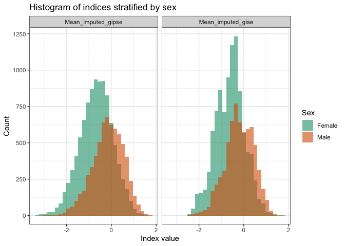
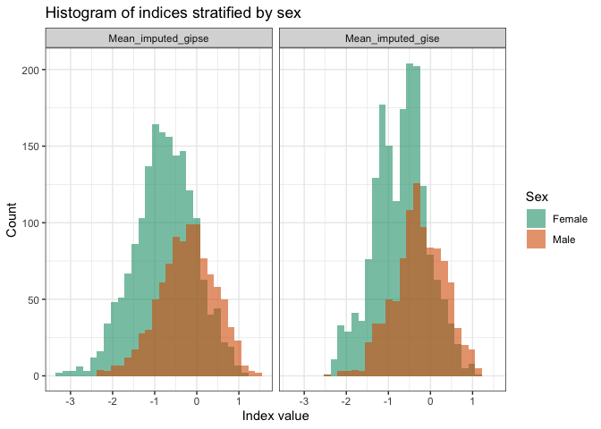
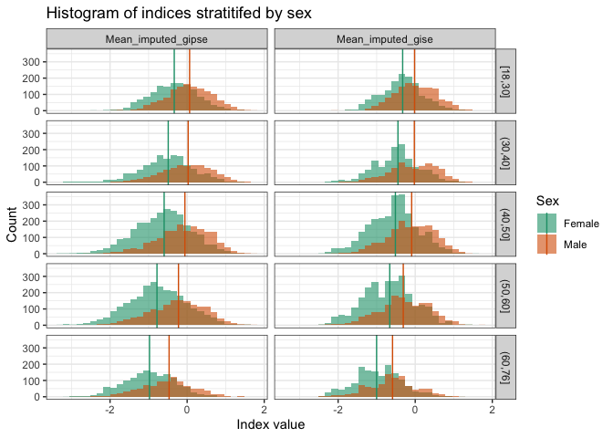

```r
library(tidyverse)
```

```
## ── Attaching core tidyverse packages ──────────────────────── tidyverse 2.0.0 ──
## ✔ dplyr     1.1.2     ✔ readr     2.1.4
## ✔ forcats   1.0.0     ✔ stringr   1.5.0
## ✔ ggplot2   3.4.2     ✔ tibble    3.2.1
## ✔ lubridate 1.9.2     ✔ tidyr     1.3.0
## ✔ purrr     1.0.1     
## ── Conflicts ────────────────────────────────────────── tidyverse_conflicts() ──
## ✖ dplyr::filter() masks stats::filter()
## ✖ dplyr::lag()    masks stats::lag()
## ℹ Use the conflicted package (<http://conflicted.r-lib.org/>) to force all conflicts to become errors
```

```r
library(survey)
```

```
## Loading required package: grid
## Loading required package: Matrix
## 
## Attaching package: 'Matrix'
## 
## The following objects are masked from 'package:tidyr':
## 
##     expand, pack, unpack
## 
## Loading required package: survival
## 
## Attaching package: 'survey'
## 
## The following object is masked from 'package:graphics':
## 
##     dotchart
```

```r
library(plyr)
```

```
## ------------------------------------------------------------------------------
## You have loaded plyr after dplyr - this is likely to cause problems.
## If you need functions from both plyr and dplyr, please load plyr first, then dplyr:
## library(plyr); library(dplyr)
## ------------------------------------------------------------------------------
## 
## Attaching package: 'plyr'
## 
## The following objects are masked from 'package:dplyr':
## 
##     arrange, count, desc, failwith, id, mutate, rename, summarise,
##     summarize
## 
## The following object is masked from 'package:purrr':
## 
##     compact
```

```r
library(dplyr)
library(factoextra)
```

```
## Welcome! Want to learn more? See two factoextra-related books at https://goo.gl/ve3WBa
```

```r
library(labelled)
library(memisc)
```

```
## Loading required package: lattice
## Loading required package: MASS
## 
## Attaching package: 'MASS'
## 
## The following object is masked from 'package:dplyr':
## 
##     select
## 
## 
## Attaching package: 'memisc'
## 
## The following object is masked from 'package:plyr':
## 
##     rename
## 
## The following object is masked from 'package:Matrix':
## 
##     as.array
## 
## The following objects are masked from 'package:lubridate':
## 
##     as.interval, is.interval
## 
## The following objects are masked from 'package:dplyr':
## 
##     collect, recode, rename, syms
## 
## The following object is masked from 'package:purrr':
## 
##     %@%
## 
## The following object is masked from 'package:tibble':
## 
##     view
## 
## The following object is masked from 'package:ggplot2':
## 
##     syms
## 
## The following objects are masked from 'package:stats':
## 
##     contr.sum, contr.treatment, contrasts
## 
## The following object is masked from 'package:base':
## 
##     as.array
```

```r
library(sjlabelled)
```

```
## 
## Attaching package: 'sjlabelled'
## 
## The following objects are masked from 'package:labelled':
## 
##     copy_labels, remove_labels, to_character, to_factor, val_labels
## 
## The following object is masked from 'package:forcats':
## 
##     as_factor
## 
## The following object is masked from 'package:dplyr':
## 
##     as_label
## 
## The following object is masked from 'package:ggplot2':
## 
##     as_label
```

```r
library(boot)
```

```
## 
## Attaching package: 'boot'
## 
## The following object is masked from 'package:lattice':
## 
##     melanoma
## 
## The following object is masked from 'package:survival':
## 
##     aml
```

```r
library(glmnet)
```

```
## Loaded glmnet 4.1-7
```

```r
library(UpSetR)
```

```
## 
## Attaching package: 'UpSetR'
## 
## The following object is masked from 'package:lattice':
## 
##     histogram
```

```r
library(naniar)
library(RColorBrewer)
library(jtools)
```

```
## 
## Attaching package: 'jtools'
## 
## The following object is masked from 'package:memisc':
## 
##     %nin%
```

```r
library(reshape2)
```

```
## 
## Attaching package: 'reshape2'
## 
## The following object is masked from 'package:tidyr':
## 
##     smiths
```

# Load the dataset


```r
folder_path <- "/Users/tamarsofer/Library/CloudStorage/OneDrive-BethIsraelLaheyHealth/Ongoing_papers/2022_gendered_indices/"
data_with_sleep <- read_csv(file.path(folder_path, "Data/sol_sofer_sorajja_joon_covariates_20220810.csv"))
```

```
## Warning: One or more parsing issues, call `problems()` on your data frame for details,
## e.g.:
##   dat <- vroom(...)
##   problems(dat)
```

```
## Rows: 16415 Columns: 44
## ── Column specification ────────────────────────────────────────────────────────
## Delimiter: ","
## chr  (8): ID, CENTER, GENDER, BKGRD1_C7, SLEA7, WBEA1, WBEA5, WBEA10
## dbl (36): STRAT, PSU_ID, WEIGHT_FINAL_NORM_OVERALL, AGE, US_BORN, BMI, STAI1...
## 
## ℹ Use `spec()` to retrieve the full column specification for this data.
## ℹ Specify the column types or set `show_col_types = FALSE` to quiet this message.
```

```r
# load the prepared dataset
dat <- readRDS(file.path(folder_path, "Data/Data_imputed.Rds"))

# the data with missing values:
# load the prepared dataset
dat_miss <- readRDS(file.path(folder_path, "Data/Data_with_miss.Rds"))

nrow(dat)
```

```
## [1] 16415
```

# Train the two indices
Primary gendered index GISE: does not include psychological variables. Secondary gendered index GIPSE: includes also trait anxiety scale and trait depression scale (without the sleep-related item).


```r
vars_gise <- c("Marital_status",
                    "Income_level", 
                    "Employment_status",
                    "Occupation", 
                    "Education", 
                    "Current_Health_insurance", 
                    "Language_pref", 
                    "Language_acculturation", 
                    "Social_acculturation", 
                    "Ethnic_identity_score", 
                    "Years_in_US")
vars_gipse <- c(vars_gise, "STAI10", "CESD9")


for (imp_version in c("", ".1", ".2", ".3", ".4")){
  # define the model matrix for GISE 
  X_gise <- model.matrix(as.formula(paste("Sex ~",
                             paste(vars_gise, collapse = paste0(imp_version,"+")))), dat)
  
  X_gipse <- model.matrix(as.formula(paste("Sex ~",
                             paste(vars_gipse, collapse = paste0(imp_version,"+")))), dat)
                             
        
  # GISE
  set.seed(929)
  cv_lasso_gise <- cv.glmnet(X_gise, dat$Sex, alpha = 1, family = "binomial", nfolds = 5)

  # use the lambda that resulted in minimum CVM to refit the model

  set.seed(929)
  lasso_model_gise <- glmnet(X_gise, dat$Sex, family = "binomial", alpha = 1, lambda = cv_lasso_gise$lambda.min)
  gise <- lasso_model_gise %>% predict(newx = X_gise)

  # GIPSE
  cv_lasso_gipse <- cv.glmnet(X_gipse, dat$Sex, alpha = 1, family = "binomial", nfolds = 5)

# use the lambda that resulted in minimum CVM to refit the model

  set.seed(929)
  lasso_model_gipse <- glmnet(X_gipse, dat$Sex, family = "binomial", alpha = 1, lambda = cv_lasso_gipse$lambda.min)
  gipse <- lasso_model_gipse %>% predict(newx = X_gipse)

## add to the dataset
  dat[[paste0("GISE", imp_version)]]  <- gise
  dat[[paste0("GIPSE", imp_version)]]  <- gipse
             
}
```

# Summarize the results


## Creat supplemental figure 2: average imputed indices, distributions by sex

We are not standardizing them at this point, because it does not matter. 


```r
dat$Mean_imputed_gise <- rowMeans(dat[,paste0("GISE", 
                                            c("", ".1", ".2", ".3", ".4"))])

dat$Mean_imputed_gipse <- rowMeans(dat[,paste0("GIPSE", 
                                            c("", ".1", ".2", ".3", ".4"))])
                                            
dat$Sex <- dat$Sex                                            

for_plot <- pivot_longer(dat, 
                         cols = c("Mean_imputed_gise", "Mean_imputed_gipse"), 
                         names_to = "Index_type", 
                         values_to = "Index")

p <- ggplot(for_plot, aes(x = Index)) + 
    geom_histogram(aes(fill = Sex), alpha = 0.6, position = "identity") +
    ggtitle("Histogram of indices stratified by sex") + 
    theme_bw() + 
    scale_fill_brewer(palette="Dark2") + 
    xlab("Index value") + ylab("Count") 

p + facet_wrap(~Index_type)
```

```
## `stat_bin()` using `bins = 30`. Pick better value with `binwidth`.
```

<!-- -->

```r
ggsave(file = file.path(folder_path, "Results/Indices_imputed_histograms.pdf"), 
       width = 6, height = 2.7)
```

```
## `stat_bin()` using `bins = 30`. Pick better value with `binwidth`.
```

# Make a figure based only on imputed observations:


```r
ID_imp <- dat_miss$ID[!complete.cases(dat_miss)]
length(ID_imp)
```

```
## [1] 2749
```

```r
p <- ggplot(for_plot[for_plot$ID %in% ID_imp,], aes(x = Index)) + 
    geom_histogram(aes(fill = Sex), alpha = 0.6, position = "identity") +
    ggtitle("Histogram of indices stratified by sex") + 
    theme_bw() + 
    scale_fill_brewer(palette="Dark2") + 
    xlab("Index value") + ylab("Count") 

p + facet_wrap(~Index_type)
```

```
## `stat_bin()` using `bins = 30`. Pick better value with `binwidth`.
```

<!-- -->

```r
ggsave(file = file.path(folder_path, "Results/Indices_only_imputed_histograms.pdf"), 
       width = 6, height = 2.7)
```

```
## `stat_bin()` using `bins = 30`. Pick better value with `binwidth`.
```


# final figure: stratified by age. 


```r
dat$Age_group <- as.factor(cut(dat$Age, 
                            breaks =  c(min(dat$Age), 30,40, 50, 60, max(dat$Age)), 
                            include.lowest = TRUE))
                            
                            
for_plot <- pivot_longer(dat, 
                         cols = c("Mean_imputed_gise", "Mean_imputed_gipse"), 
                         names_to = "Index_type", 
                         values_to = "Index")

index_medians <- for_plot %>% group_by(Index_type, Age_group, Sex) %>% 
  summarize_at(vars(Index), list(index_median = median)) 


p <- ggplot(for_plot, aes(x = Index)) + 
  geom_histogram(aes(fill = Sex), alpha = 0.6, position = "identity") +
  ggtitle("Histogram of indices stratitifed by sex") + 
  theme_bw() + 
  scale_fill_brewer(palette="Dark2") + 
  xlab("Index value") + ylab("Count") 

p + facet_grid(Age_group~Index_type) + 
  geom_vline(data = index_medians, mapping = aes(xintercept = index_median, color = Sex)) + 
  scale_color_brewer(palette="Dark2")
```

```
## `stat_bin()` using `bins = 30`. Pick better value with `binwidth`.
```

<!-- -->

```r
ggsave(file = file.path(folder_path, "Results/Indices_imputed_histograms_by_age.pdf"), 
       width = 6, height = 2.7)
```

```
## `stat_bin()` using `bins = 30`. Pick better value with `binwidth`.
```


# Save the dataset for future use


```r
saveRDS(dat, file.path(folder_path, "Data/Data_imputed_with_indices.Rds"))
```


```r
sessionInfo()
```

```
## R version 4.2.3 (2023-03-15)
## Platform: aarch64-apple-darwin20 (64-bit)
## Running under: macOS Ventura 13.6
## 
## Matrix products: default
## BLAS:   /Library/Frameworks/R.framework/Versions/4.2-arm64/Resources/lib/libRblas.0.dylib
## LAPACK: /Library/Frameworks/R.framework/Versions/4.2-arm64/Resources/lib/libRlapack.dylib
## 
## locale:
## [1] en_US.UTF-8/en_US.UTF-8/en_US.UTF-8/C/en_US.UTF-8/en_US.UTF-8
## 
## attached base packages:
## [1] grid      stats     graphics  grDevices utils     datasets  methods  
## [8] base     
## 
## other attached packages:
##  [1] reshape2_1.4.4     jtools_2.2.2       RColorBrewer_1.1-3 naniar_1.0.0      
##  [5] UpSetR_1.4.0       glmnet_4.1-7       boot_1.3-28.1      sjlabelled_1.2.0  
##  [9] memisc_0.99.31.6   MASS_7.3-60        lattice_0.21-8     labelled_2.12.0   
## [13] factoextra_1.0.7   plyr_1.8.8         survey_4.2-1       survival_3.5-5    
## [17] Matrix_1.5-4.1     lubridate_1.9.2    forcats_1.0.0      stringr_1.5.0     
## [21] dplyr_1.1.2        purrr_1.0.1        readr_2.1.4        tidyr_1.3.0       
## [25] tibble_3.2.1       ggplot2_3.4.2      tidyverse_2.0.0   
## 
## loaded via a namespace (and not attached):
##  [1] sass_0.4.7        bit64_4.0.5       vroom_1.6.3       jsonlite_1.8.7   
##  [5] splines_4.2.3     foreach_1.5.2     carData_3.0-5     bslib_0.5.0      
##  [9] highr_0.10        pander_0.6.5      yaml_2.3.7        ggrepel_0.9.3    
## [13] pillar_1.9.0      glue_1.6.2        visdat_0.6.0      digest_0.6.33    
## [17] colorspace_2.1-0  htmltools_0.5.5   pkgconfig_2.0.3   haven_2.5.3      
## [21] scales_1.2.1      tzdb_0.4.0        timechange_0.2.0  farver_2.1.1     
## [25] generics_0.1.3    car_3.1-2         cachem_1.0.8      withr_2.5.0      
## [29] cli_3.6.1         magrittr_2.0.3    crayon_1.5.2      evaluate_0.21    
## [33] fansi_1.0.4       textshaping_0.3.6 tools_4.2.3       data.table_1.14.8
## [37] hms_1.1.3         mitools_2.4       lifecycle_1.0.3   munsell_0.5.0    
## [41] compiler_4.2.3    jquerylib_0.1.4   systemfonts_1.0.4 rlang_1.1.1      
## [45] iterators_1.0.14  rstudioapi_0.15.0 labeling_0.4.2    rmarkdown_2.23   
## [49] gtable_0.3.3      codetools_0.2-19  abind_1.4-5       DBI_1.1.3        
## [53] R6_2.5.1          gridExtra_2.3     knitr_1.43        bit_4.0.5        
## [57] fastmap_1.1.1     utf8_1.2.3        ragg_1.2.5        insight_0.19.3   
## [61] shape_1.4.6       stringi_1.7.12    parallel_4.2.3    Rcpp_1.0.11      
## [65] vctrs_0.6.3       tidyselect_1.2.0  xfun_0.39
```
